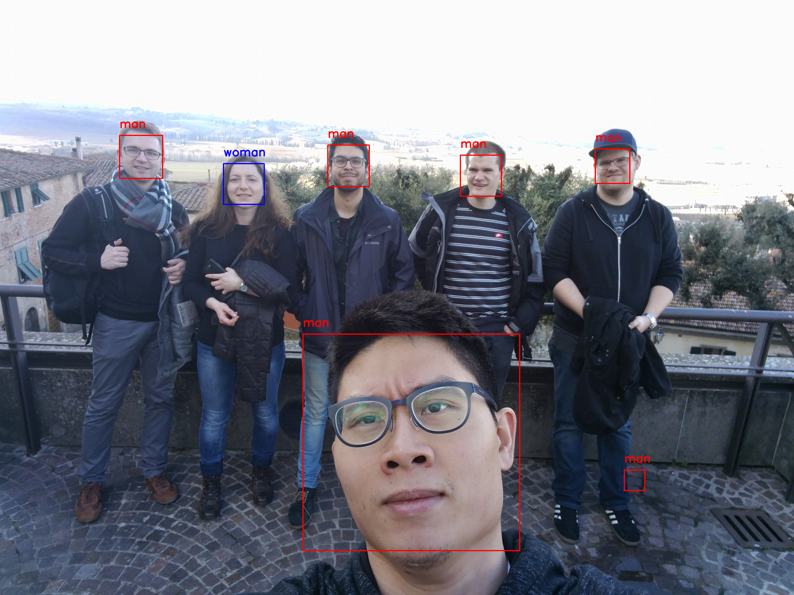

# face_classification by Paddle

| model | acc | acc(repo) |
| --- | --- |
| MiniXception | 95.58% | 95% |
| SimpleCNN | 95.76% | 94.88% |

## dataset 
download imdb dataset (gender classification) from [link](https://data.vision.ee.ethz.ch/cvl/rrothe/imdb-wiki/) and unzip it to dataset folder
```bash
tar -xf imdb_crop.tar
```

## train

set `images_path` in line 33 of [train.py](train.py) and use follow script to start training
```python
python3 train.py
```

## eval

set `images_path` and 'model_path' in line 28 and 29 of [eval.py](eval.py) and use follow script to start eval
```python
python3 eval.py
```

## demo

set `gender_model_path` in line 64 of [demo.py](demo.py) and use follow script to start eval
```python
python3 demo.py
```

sample

